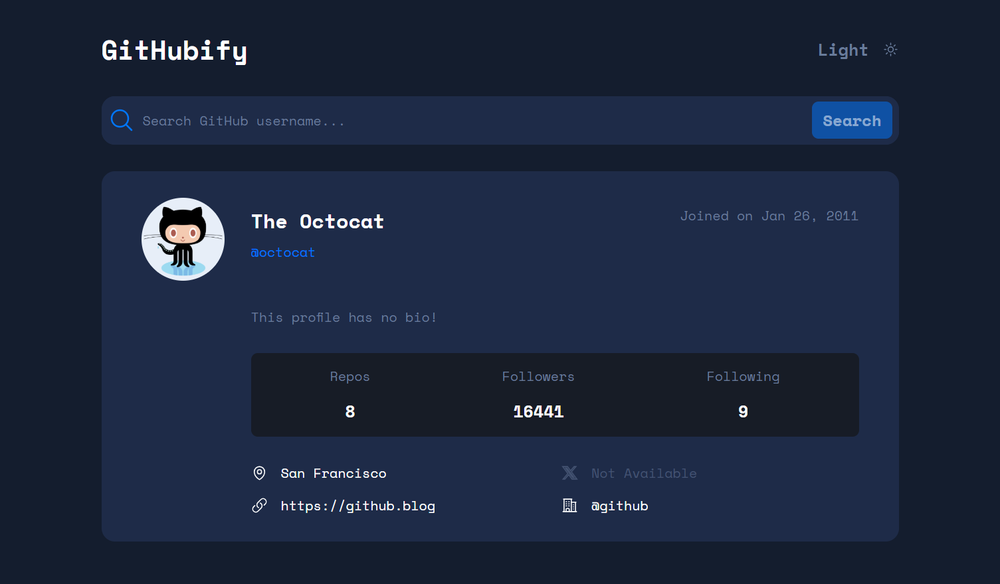
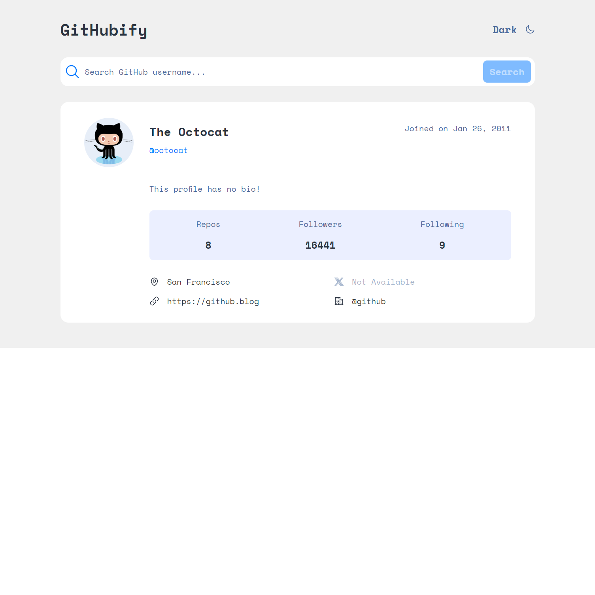
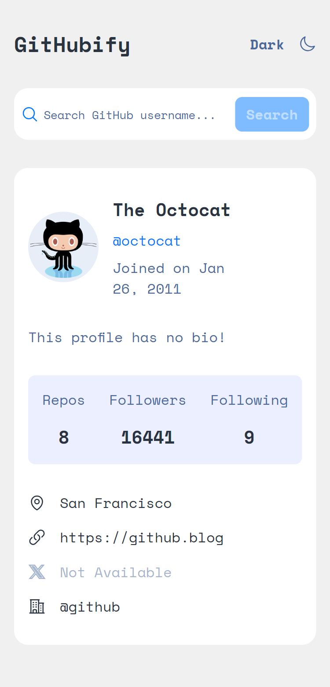

# GitHubify 🚀

> Explore GitHub profiles with style and elegance

GitHubify is a modern, responsive React application that transforms the way you explore GitHub profiles. With its sleek interface, theme customization, and real-time data fetching, GitHubify makes profile discovery a delightful experience.

## 🌟 Live Demo

[Check out GitHubify in action](https://githubify-five.vercel.app/)

## 📸 Screenshots

<details>
<summary>Click to view screenshots</summary>

### Dark Theme



### Light Theme



### Mobile View



</details>

## ✨ Features

- **Real-time Profile Search**: Instantly fetch and display GitHub user profiles
- **Theme Switching**: Seamlessly toggle between light and dark themes
- **Responsive Design**: Optimized for mobile (320px), tablet (768px), and desktop (1024px+)
- **Accessibility**: ARIA labels, semantic HTML, and keyboard navigation
- **Error Handling**: Clear error messages for failed searches or API issues
- **Local Storage**: Persists theme preference across sessions

## 🛠️ Tech Stack

- **React 18.3.1** - UI library
- **React Context API** - State management
- **GitHub REST API** - Profile data fetching
- **CSS3** - Custom styling with CSS variables
- **Vite 6.0.5** - Build tool and development server
- **ESLint 9.17.0** - Code quality and consistency

## 🚀 Getting Started

1. Clone the repository:

```bash
git clone https://github.com/KeepSerene/github-user-search-site-react.git
```

2. Install dependencies:

```bash
cd githubify
npm install
```

3. Start the development server:

```bash
npm run dev
```

4. Open [http://localhost:5173](http://localhost:5173) in your browser

## 🎨 Customization

GitHubify uses CSS custom properties for easy theme customization. For example,

```css
:root {
  --primary-blue: 212 100% 50%;
  --light-bg-primary: 0 0% 94%;
  --light-bg-secondary: 0 0% 100%;
  --light-bg-accent: 227 100% 96%;
  --light-text-primary: 217 21% 21%;
  --light-text-secondary: 217 35% 45%;
}

[data-theme="dark"] {
  --bg-primary: var(--dark-bg-primary);
  --bg-secondary: var(--dark-bg-secondary);
  --bg-accent: var(--dark-bg-accent);
  --text-primary: var(--dark-text-primary);
  --text-secondary: var(--dark-text-secondary);
  --primary: var(--primary-blue);
}
```

## 📱 Responsive Breakpoints

- Mobile: 320px - 767px
- Tablet: 768px - 1023px
- Desktop: 1024px and above

## ♿ Accessibility Features

- Semantic HTML structure
- ARIA labels for interactive elements
- Keyboard navigation support
- High contrast color schemes
- Screen reader friendly content

## 🔍 API Usage

GitHubify uses the GitHub Users API:

```javascript
GET https://api.github.com/users/{username}
```

Key data points retrieved:

- Profile information
- Repository count
- Follower statistics
- Social links
- Join date

## 👨‍💻 Author

**[Dhrubajyoti Bhattacharjee]**

- GitHub: [@KeepSerene](https://github.com/KeepSerene)
- Portfolio: [MathToDev](https://math-to-dev.vercel.app/)
- Twitter: [@UsualLearner](https://x.com/UsualLearner)

## 📄 License

This project is licensed under the MIT License - see the [LICENSE](LICENSE) file for details.

## 🙏 Acknowledgments

- Design inspiration from [Frontend Mentor](https://www.frontendmentor.io)
- Icons from Heroicons
- GitHub API documentation and team

---

<p align="center">Made with ❤️ and React</p>
